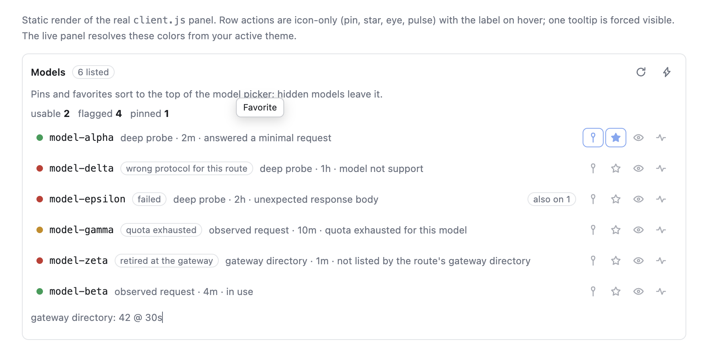

# dsh-llm-manage

A persistent [DeepSeek Harness](https://github.com/deepseek-ai/deepseek-harness) plugin that
manages the model inventory of a configured LLM route: pins and favorites, a per-model
reason why each model is unusable, gateway directory reconciliation, and automatic
fallback when one model's quota runs out.



*Rendered by `node preview.mjs` from six fixture models, so every status the panel can show
appears at once — usable, wrong protocol, failed, quota exhausted, retired, and in use.
Colours are resolved from your active theme at runtime.*

## Why

A route that aggregates many providers behind one gateway exposes its whole catalogue as
one flat list. Five things then go wrong at once, and none of them is the gateway's fault:

| Pain | What this plugin does |
|---|---|
| A long list, favorites buried | Pin and favorite models; the picker and the panel sort pinned → favorite → recent → rest |
| Retired models still listed; selecting one errors | Reconciles the route's `models:` list against the gateway's own `GET {baseURL}/models` directory and flags anything missing as retired |
| Quota exhausted, manual switching | Watches `agent/request-error`, switches to the next usable model on a model-scoped quota failure, and shows a banner naming the model it moved for |
| The same model served by several providers | Marks each row with how many other routes also serve it, instead of hiding the copies |
| Models that cannot be called at all | Probes with a minimal request and labels the incompatibility honestly |

Nothing here is hard-coded to one gateway or one model id.

## Install

```
dsh plugin --profile web add /absolute/path/to/dsh-llm-manage
```

`dsh plugin` forwards the arguments after `--profile <name>` to pnpm inside that profile's
directory, so anything pnpm accepts works here (`add`, `remove`, `why`, …). Installing from a
path links the directory, which is what makes local edits show up without reinstalling; use
the git URL instead to get a copy:

```
dsh plugin --profile web add git+https://github.com/PhilYue/dsh-llm-manage.git
```

The package installs as a bundle: its `dsh.bundle.patch` row inserts one Host plugin, and
its `dsh.client` declaration makes the web shell load the browser half. The Host half
needs a **full harness restart**; the browser half is picked up by the client HMR watcher,
so a page refresh is enough. See "Applying a change" below.

## Configuration

Every value lives in the plugin row's `config`, so your own patch layer keeps overrides
across upgrades. Defaults:

```yaml
- id: llm-manage
  name: 'dsh-llm-manage'
  config:
    selector:
      mode: managed     # 'native' withdraws the shadowed picker
    probe:
      intervalMs: 1200  # delay between deep probes
      timeoutMs: 30000
      batch: 40         # probes accepted per request
    directory:
      ttlMs: 1800000    # how long a gateway directory read is trusted
    fallback:
      enabled: true
      chain: []         # 'route/model' entries, tried first
```

The fallback chain order is: `fallback.chain`, then pinned models, then favorites, then the
remaining models on the same route, then other routes. Models already known to be retired,
protocol-incompatible, hidden, or inside their quota cooldown are skipped. At most three
automatic switches happen per turn.

### Which failures switch, and which never do

The rule is **scope**, not severity:

| Failure | Scope | Switches? |
|---|---|---|
| model not found / retired | one model | yes |
| wrong protocol for this route | one model | yes |
| per-model quota exhausted | one model | yes |
| other per-model failures | one model | yes |
| account-wide rate limit | the whole API key | **never** |
| account-wide quota | the whole API key | **never** |

A model-scoped failure moves to another model, because a different model can serve the
turn. An account-scoped failure never moves: every model shares that key, so switching
would only hide the real problem and burn another request.

Some gateways report a *model's* quota exhaustion as HTTP 429, which the harness's own
classifier maps to a retryable `RATE_LIMIT` — indistinguishable from an account-wide rate
limit. The two need opposite handling, so this plugin reads the gateway's numeric business
code out of the error body instead of trusting the mapped code. The code table is at the
top of `index.js`; adjust it there if your gateway numbers things differently.

## Why probing is manual

`GET /v1/models` is free but is only a directory, not a callability list: a model can be
advertised and still fail on first use (wrong protocol, no capacity, image-only). Probing
each model deeply is therefore the only way to learn whether it works — and deep probes
spend the gateway's **per-key** rate budget, so a sweep large enough to be useful is also
large enough to rate-limit the user out of their own gateway.

Health is learned cheapest-first instead:

1. the free directory set,
2. real request failures as they happen (passive, zero extra traffic),
3. explicit probes the user starts, throttled at `probe.intervalMs` and capped at `probe.batch`.

A model that has never been attempted reads as `unknown`, never as usable.

## Verifying it

Three suites, all runnable without any particular deployment:

```
node verify.mjs          # Host half: registry, gateway, classification, fallback
node verify-client.mjs   # Browser half: renders the panel in jsdom and clicks it
node verify-browser.mjs  # Control geometry in a real engine (headless Chrome)
```

Each suite picks a mode automatically:

- **`real`** — this machine has a profile whose first provider route resolves, plus that
  route's credential. The settings under test are then the deployed ones, and the gateway
  directory is read live. This is the mode that catches a fixture agreeing with a wrong
  assumption.
- **`synthetic`** — otherwise. A local stub serves a synthetic catalogue, so every code
  path still runs: offline, deterministically, with no credential and no internal endpoint.

```
LLMM_VERIFY_MODE=synthetic node verify.mjs    # force a mode
DSH_CHECKOUT=/path/to/deepseek-harness node verify.mjs
```

`DSH_CHECKOUT` points at the harness checkout, which supplies the real Tool registry,
React and jsdom. It is not vendored here; the suites try a few conventional locations and
then tell you what to set.

`verify.mjs` also gates the **publish surface**: where the maintainer's
company-information scanner is present it fails if the runtime files (`index.js`,
`client.js`, `package.json`, `cordis.patch.yml`, `icon.svg`) contain anything identifying
a particular employer or internal service; in this published package the scanner is
absent, and the gate says so rather than reporting a pass it did not perform. The scanner
is not shipped because its own rule patterns have to quote the identifiers they look for.

Some checks exist because the live harness caught bugs a shallower suite passed:

- **The suites execute the registered tool**, not just register it. A definition can
  register cleanly and throw on its first call.
- **The fixture context enforces Cordis's inject guard**, so reading `ctx.llm` from
  `apply`'s own context fails exactly as it does live.
- **Never test one half alone.** The two halves can agree on every type and still disagree
  on a field name: the panel once folded `data.snapshot` while the Host returned the same
  state under `value`, so pin/favorite/hide updated nothing until the user reloaded by
  hand. A Host-only suite passed it, and so did a client suite whose other half was a mock
  returning whatever field the client asked for.
- **`verify-browser.mjs`** exists because jsdom has no layout: every
  `getBoundingClientRect()` returns zeros, so a tooltip's position and a button's width
  cannot be measured in-process. It loads the real panel into headless Chrome and asserts
  the geometry the design depends on, then skips with exit 0 when no Chrome-family binary
  is present (`CHROME_PATH` overrides).

### Looking at the panel without restarting

```
node preview.mjs         # writes panel-preview.html
```

Renders the real panel to a standalone HTML file with theme tokens inlined, so the control
design can be reviewed in a browser while the harness is running. A development aid, not a
test.

## Where it appears

- **Settings → Models → the provider card**: the management panel.
- **The composer model picker**: the managed picker (set `selector.mode: native` to
  withdraw it and get the shipped picker back untouched).
- **Above the composer**: a banner when this session's model was switched.

### Panel controls

Row actions are **icon-only** buttons with the label on hover and on keyboard focus, so
four controls fit beside a model name instead of wrapping the row: pin, favorite, hide,
probe. Each carries an `aria-label`, so it stays readable to a screen reader. The header's
two actions (re-check the gateway, deep-probe all) use the same treatment.

The tooltip is rendered at the panel root rather than inside the row, because the row list
is a scroll container that would clip it; it is positioned against the viewport and clamped
so a button near an edge cannot push the label off-screen.

Clicking an action updates the row in the same frame (the flag is applied locally first)
and the Host's authoritative snapshot then replaces it. A failed request rolls the row
back, so the panel never keeps claiming a state the Host refused. Row actions stay visible
at reduced opacity instead of appearing only on hover, because a touch device has no hover.

Every mutating action returns the new state under a top-level `snapshot`; that is the
contract that makes the optimistic update safe.

## Storage

One atomically-written JSON document per route under
`$DSH_HOME/storages/llm-manage/<route>.json`, holding `favorites`, `pins`, `hidden`,
`recent` and `health` (`status`, `source`, `detail`, `scope`, `at`). Deleting the file
resets that route's overlay.

## Agent tool

The `llm_models` tool exposes the same operations: `snapshot`, `pin`, `unpin`, `favorite`,
`unfavorite`, `hide`, `unhide`, `probe`, `sync`, `diagnostics`. `snapshot` and `diagnostics`
need no extra arguments; `sync` needs `route`; `probe` and the overlay actions need both
`route` and `model`. The browser half reads the same data over `POST /api/llm-manage`.

## Applying a change after install

The profile installs this package as a **symlink**, so file edits land in the running
profile immediately. The two halves then behave differently.

**`index.js` (Host half) needs a full harness restart.** The host HMR watcher skips
`node_modules`, where the install symlink lives, and its watch root is the profile
directory — while the real file resolves outside it. A marker written into `index.js` was
still absent from the running Host's responses minutes later, against a listener process
started the previous evening.

**`client.js` (Client half) reloads on its own.** The client HMR watcher is a stat poll
(default 500 ms) over every row in the composed graph — no `node_modules` exclusion — and
it re-reads the bundle from disk. Touching `client.js` produces a
`rebuilt` frame on `/plugins/events`, and the revision the server then advertises matches
one computed from the new file's `mtime`/`ctime`/`size`.

Enabling or disabling the bundle does not bust the ESM module cache for either half.

## Known limits

- Deep probing assumes the OpenAI-compatible `/chat/completions` shape. A route speaking
  another protocol is reported as probed-with-this-shape, not as protocol-aware.
- Protocol mismatches are **labelled, not fixed**. A model's protocol cannot be set
  per-model: `api` is a route-level setting. The supported workaround is registering the
  same `baseURL` as a second route with `api: anthropic-messages` — which only helps if
  your gateway actually serves that endpoint. If it does not, the model is reported as
  protocol-incompatible rather than silently "fixed".
- Passive learning needs a real failed request to observe a reason.
- The quota fallback needs the failing model's id, which it takes from the last
  `agent/request` it observed for that session.
- The managed picker shadows the shipped picker at `priority: -1` and re-supplies its
  `inject` face. That face is a per-registration business contract, so a future change to
  the shipped picker's face needs this plugin updated in step. `selector.mode: native`
  withdraws the shadow without a restart.

## Licence

MIT — see [LICENSE](LICENSE).
